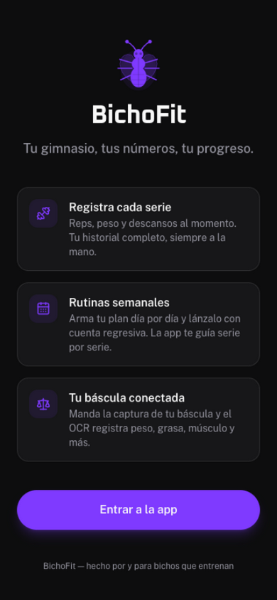
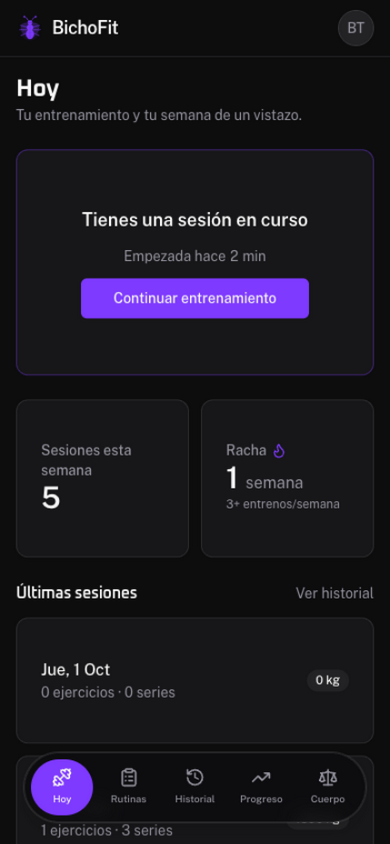
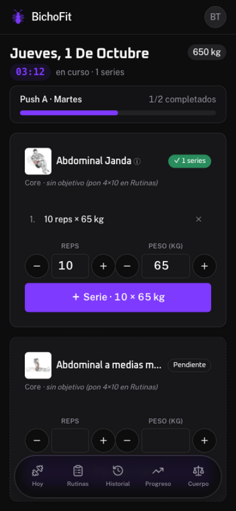
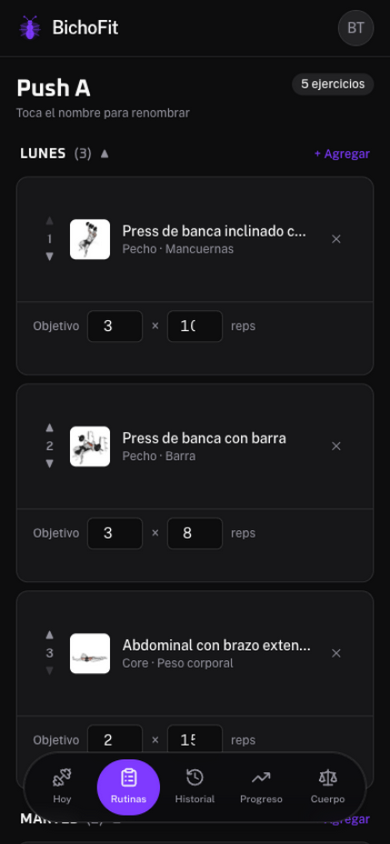
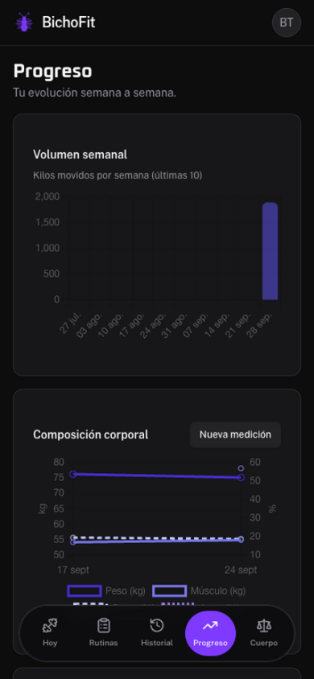
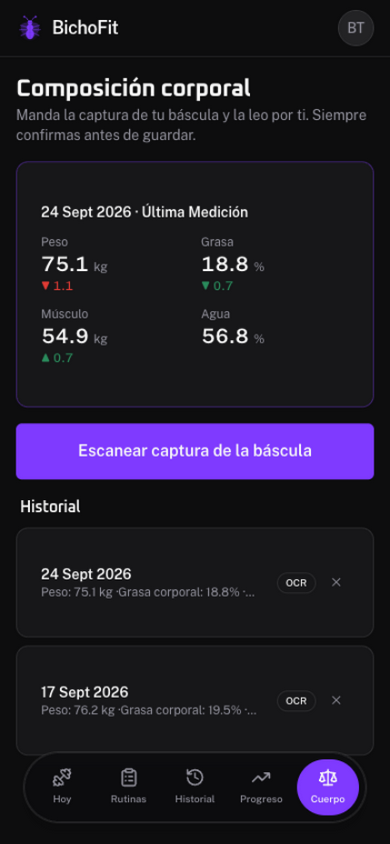

<div align="center">

# 🦎 BichoFit

**Tu gimnasio, tus números, tu progreso.**

PWA self-hosted para registrar entrenamientos, armar rutinas semanales
y seguir tu composición corporal — con OCR para leer las capturas de tu
báscula de bioimpedancia.

[](https://laravel.com)
[](https://svelte.dev)
[](https://inertiajs.com)
[](https://www.postgresql.org)
[](https://www.docker.com)
[](./tests)
[](LICENSE)
[](CONTRIBUTING.md)

</div>

---

## Capturas

|                                                                      |                                                            |
| :------------------------------------------------------------------: | :--------------------------------------------------------: |
|                   **Inicio** — propuesta de valor                    |            **Hoy** — arranque con racha semanal            |
|                             |                         |
| **Entrenamiento** — checklist por objetivo, GIF de guía y cronómetro | **Rutinas** — plan semanal editable con guardado por lotes |
|               |                 |
|          **Progreso** — volumen, 1RM estimado y composición          |      **Cuerpo** — OCR de la báscula con confirmación       |
|                         |                   |

---

## Características

### Entrenamiento

- **Arranque con asistente**: Comenzar → elegir rutina → elegir día →
  vista previa → cuenta regresiva 3·2·1 → a entrenar
- **Registro por series con slots**: si tu rutina dice `4x10`, la sesión
  pre-estructura las 4 series con las reps listas y el peso a un toque
  (steppers ±2.5 kg); cada serie guarda su propio peso y reps
- **Checklist de rutina**: ejercicios completados ✓ / pendientes, barra de
  progreso y orden siempre fiel a tu plan
- **Guía visual en vivo**: GIF animado de técnica en cada ejercicio
  (1,324 ejercicios con instrucciones paso a paso en español)
- **Cronómetro de sesión** en vivo (mm:ss)

### Rutinas semanales

- Arma tu plan **día por día** (Lunes a Domingo), con reordenamiento,
  colapso por día y objetivo por ejercicio (`4x10`)
- **Guardado por lotes**: editas todo en borrador y un solo
  _Guardar cambios_ sincroniza en una transacción
- Catálogo de **1,391 ejercicios** en español con búsqueda bilingüe
  (español/inglés) y ejercicio personalizados por usuario

### Progreso

- **Volumen semanal** (últimas 10 semanas)
- **Progresión por ejercicio** con peso máximo y **1RM estimado** (Epley)
- **Tabla de récords** personales
- **Composición corporal** en gráfica de 4 líneas con doble eje kg/%

### Cuerpo (OCR de báscula)

- Sube la captura de tu app de báscula (cámara o galería) y **Tesseract**
  la lee en el servidor: peso, grasa, músculo, agua, masa ósea, IMC,
  grasa visceral, edad metabólica + extras (proteína, BMR, masa magra…)
- Parser multiforma: etiqueta-valor en la misma línea, en tarjetas o en
  columnas — afinado para **OKOK International** (básculas Gaabor) y
  diccionario extensible
- **Siempre confirmas antes de guardar**, con confianza por campo
  marcada; entrada manual como respaldo
- Última medición con **deltas vs la anterior**

### Cuenta

- Auth completa: correo/contraseña, passkeys, 2FA con códigos de
  recuperación
- Aislamiento total entre usuarios (policies en cada recurso)
- UI 100% en español, incluidos mensajes de validación del servidor

---

## Stack

| Capa          | Tecnología                                                                            |
| ------------- | ------------------------------------------------------------------------------------- |
| Backend       | Laravel 13 (PHP 8.4) · Eloquent · Policies · Form Requests                            |
| Frontend      | Svelte 5 (runes) · Inertia 3 · Tailwind CSS v4 · Chart.js                             |
| Tema          | Personalizado _Rhea_ — base Zinc, primario Violeta, tipografías Oxanium + Public Sans |
| Base de datos | PostgreSQL 16                                                                         |
| OCR           | Tesseract 5 (spa+eng) con parser propio                                               |
| Deploy        | Docker · FrankenPHP (HTTPS automático)                                                |

---

## Desarrollo local

Requisitos: PHP 8.3+, Composer, Node 22+, Docker (para Postgres).

```bash
# 1. Dependencias
composer install
npm install

# 2. Postgres en Docker (puerto 5433 para no chocar con uno local)
docker compose up -d db

# 3. Configuración
cp .env.example .env
php artisan key:generate

# 4. Migraciones + catálogo base
php artisan migrate --seed

# 5. (Opcional) Importar el dataset completo de ejercicios con guías
#    visuales — repo: github.com/hasaneyldrm/exercises-dataset
php artisan exercises:import /ruta/al/exercises-dataset

# 6. Servir
php artisan serve --port=8088
```

### Pruebas

```bash
php artisan test    # 81 pruebas · 333 aserciones
npm run build       # verificación del frontend
```

---

## Deploy en VPS

Un `docker compose up` levanta la app (FrankenPHP) y Postgres, con
migraciones y seed idempotentes al arrancar; Tesseract viene incluido
en la imagen.

```bash
git clone https://github.com/Luis-Trinidad/BichoFit.git
cd BichoFit
docker compose build

# Variables de producción
cat > .env <<'EOF'
APP_KEY=base64:...   # docker compose run --rm app php artisan key:generate --show
APP_URL=https://bichofit.tudominio.com
SERVER_NAME=bichofit.tudominio.com:443
DB_PASSWORD=una-contraseña-segura
EOF

docker compose up -d   # TLS automático vía Let's Encrypt
```

> El media del dataset (GIF/miniaturas) no viaja en el repo: tras el
> primer arranque, copia el dataset al VPS y corre una vez
> `php artisan exercises:import /ruta/al/dataset` (idempotente).

Operación:

```bash
docker compose exec db pg_dump -U bichofit bichofit > backup.sql   # respaldo
docker compose logs -f app                                         # logs
git pull && docker compose up -d --build                           # actualizar
```

---

## Estructura del proyecto

```
app/
├── Console/Commands/ImportExercises.php   # importador del dataset (traduce nombres)
├── Controllers/                           # Dashboard, rutinas, sesiones, progreso, OCR
├── Policies/                              # aislamiento por usuario
└── Support/
    ├── BodyScanTextParser.php             # parser OCR multiforma
    └── ExerciseNameTranslator.php         # traducción estructural EN→ES

database/
├── data/exercise-names-es.json            # diccionario (979 núcleos, 100% cobertura)
└── migrations/

resources/js/
├── components/                            # picker, guía visual, steppers, navbar
└── pages/                                 # Hoy, Rutinas, Progreso, Cuerpo, settings, auth

docker/                                    # Caddyfile + entrypoint
docs/                                      # diseño y capturas
```

---

## Roadmap

- [x] Entrenamiento en vivo con historial
- [x] Rutinas semanales por día + asistente de arranque
- [x] Gráficas de progreso y récords
- [x] OCR de báscula (OKOK/Gaabor)
- [x] Tema propio y UI 100% en español
- [ ] PWA instalable (manifest + service worker + ícono)
- [ ] Timer de descanso entre series

---

## Contribuir

¡Las contribuciones son bienvenidas! Lee [CONTRIBUTING.md](CONTRIBUTING.md)
para el setup, convenciones y áreas que agradecen ayuda.

Reporta bugs con la plantilla de [issues](https://github.com/Luis-Trinidad/BichoFit/issues/new/choose)
y revisa el [código de conducta](CODE_OF_CONDUCT.md). Vulnerabilidades de
seguridad: [SECURITY.md](SECURITY.md) (reporte privado, no issues públicos).

---

## Créditos

- Ejercicios y guías visuales: [exercises-dataset](https://github.com/hasaneyldrm/exercises-dataset)
  — media © [Gym Visual](https://gymvisual.com/) (180×180, con atribución)
- Construido con Laravel, Svelte, Inertia, Tailwind y Tesseract

<div align="center">

**Hecho por y para bichos que entrenan** 🦎

</div>
